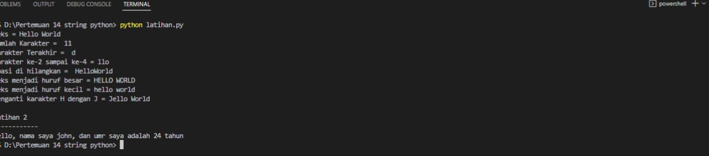

# Pertemuan 14

- Nama :     Doni perdana siringoringo
- Nim  :     312210687
- Kelas:     TI.22.B1


# String python
Code latihan 1 dan penjelasan

```
txt = 'Hello World'
print(f"Teks = {txt}")
# Menghitung jumlah karakter
print("Jumlah Karakter = ",len(txt))
# Mengambil karakter terakhir
a = txt[-1]
print('Karakter Terakhir = ',a)
# Mengambil karakter ke-2 sampai ke-4
b = txt[2:5]
print(f"Karakter ke-2 sampai ke-4 = {b}")
# Hilangkan spasi pada text 
c = txt.replace(" ","")
print("Spasi di hilangkan = ",c)
# Ubah teks menjadi huruf besar
d = txt.upper()
print(f"Teks menjadi huruf besar = {d}")
# Ubah teks menjadi huruf kecil
e = txt.lower()
print(f"Teks menjadi huruf kecil = {e}")
# Ganti karakter H dengan karakter J
f = txt.replace("H","J")
print(f"Menganti karakter H dengan J = {f}")
```
# Berikut code nya

.png)

# Latihan 2

```
umur = 24
txt = 'Hello, nama saya john, dan umur saya adalah {0} tahun'
print(txt.format(umur))
```


# Hasil running





# Sekian penjelasan saya ucapkan terimakasih


